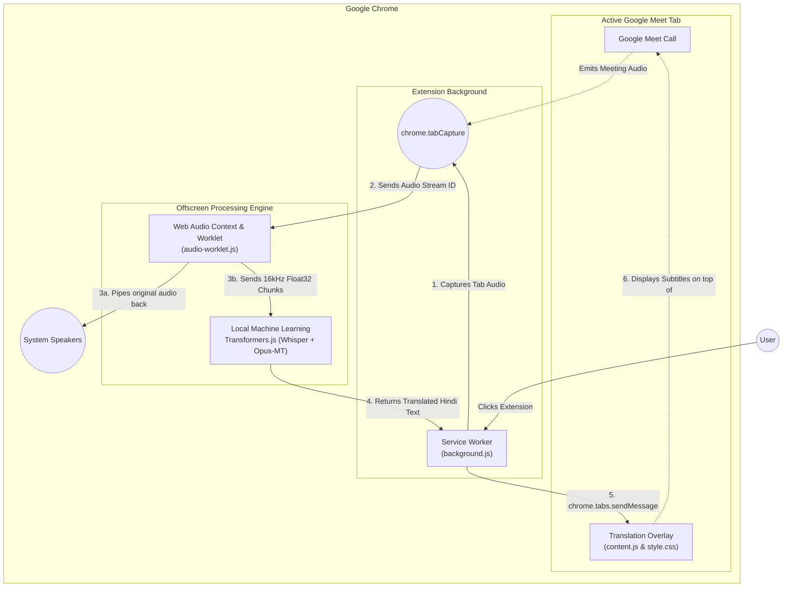

# FluentMeet AI

A real-time translation Chrome Extension designed for Google Meet. It captures live meeting audio and uses on-device machine learning models to instantly transcribe and translate the conversation.

> **Note**: While the manifest originally describes using SeamlessM4T, the current implementation leverages **Whisper (Xenova/whisper-tiny.en)** for fast automatic speech recognition (ASR) and **Opus-MT (Xenova/opus-mt-en-hi)** for English-to-Hindi translation directly within the browser using WebAssembly.

---

## 🛠️ Key Features

- **On-Device Inferencing**: Uses `@xenova/transformers` to process models natively in your browser using WASM. No external API keys or cloud services required!
- **Zero-Latency Audio Passthrough**: Tab audio is captured and analyzed without muting your meeting.
- **Robust DOM UI**: Creates a translation screen that stays visible above the Google Meet interface, fully compliant with Google's strict Trusted Types Content Security Policy.
- **Smart Audio Overlap**: Audio window chunking with an overlapping buffer ensures that words spoken across processing boundaries are seamlessly transcribed without being clipped.

---

## 🏗️ Architecture & Data Flow

The extension consists of several loosely coupled components that safely extract audio, run machine learning models in a hidden sandbox, and overlay results on the screen.

---

## 📂 Project Structure

- **`manifest.json`**: Extension configuration, declaring required permissions (`tabCapture`, `offscreen`, `activeTab`, etc.).
- **`src/background.js`**: Service worker that manages extension state, requests tab capture streams, coordinates messaging between active tabs, and spawns the offscreen document.
- **`src/content.js`**: Injected script that generates a transparent text-overlay UI on Google Meet (`DIV#seamless-translation-box`). It receives and displays the spoken captions without triggering CSP violations.
- **`src/style.css`**: Styling directives for the translation box overlay, maintaining a high `z-index` to hover above Meet controls.
- **`src/offscreen.html` & `src/offscreen.js`**: The hidden processing hub that hosts both the audio context and the `transformers.js` AI pipeline, preventing main UI thread blocking.
- **`src/audio-worklet.js`**: Audio hook running inside the Audio Context thread to sample `16kHz` array buffers required by Whisper.
- **`src/transformers.js`**: Minified library for `@xenova/transformers`.

---

## 🚀 Setup & Installation

1. Clone or download this repository.
2. Open your Google Chrome browser and navigate to `chrome://extensions/`.
3. Enable **Developer mode** via the toggle switch in the top right corner.
4. Click on **Load unpacked** and select the directory containing this project.
5. Navigate to a [Google Meet](https://meet.google.com/) call.
6. Click the newly added **FluentMeet AI** extension icon in your Chrome toolbar.
7. Allow a minute or two upon first run for the heavy AI models to download and cache locally on your machine.
8. Start speaking!
